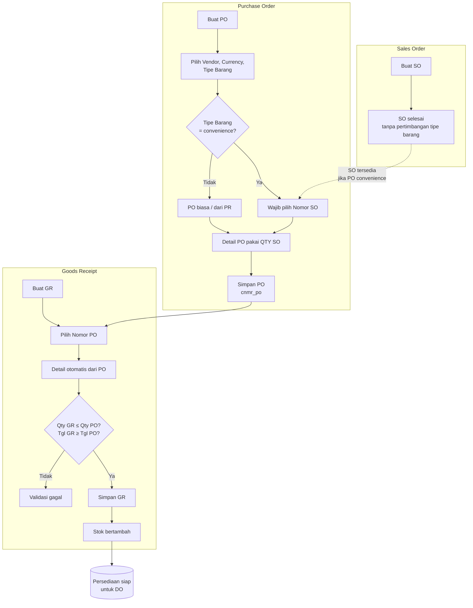
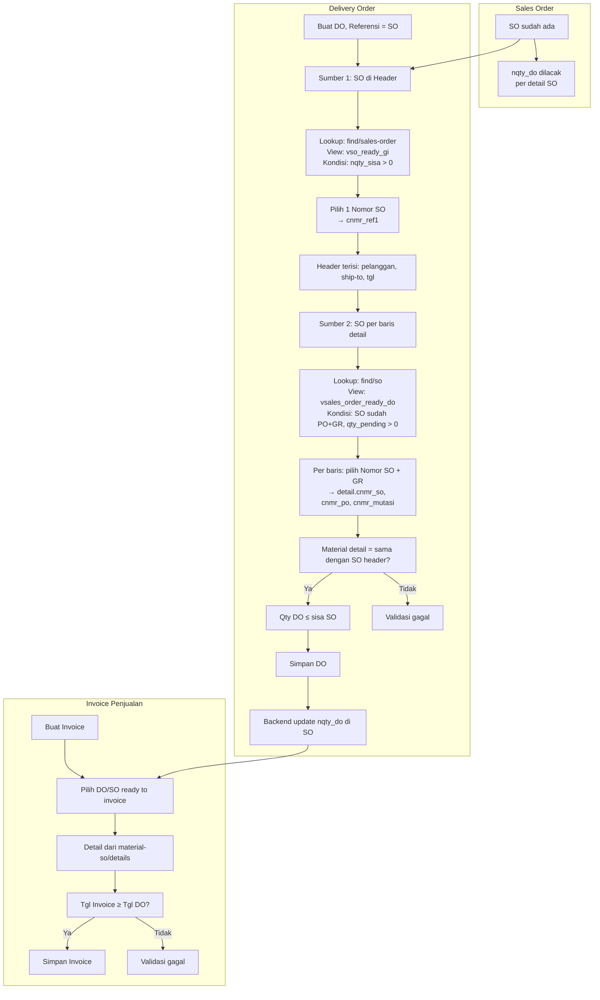
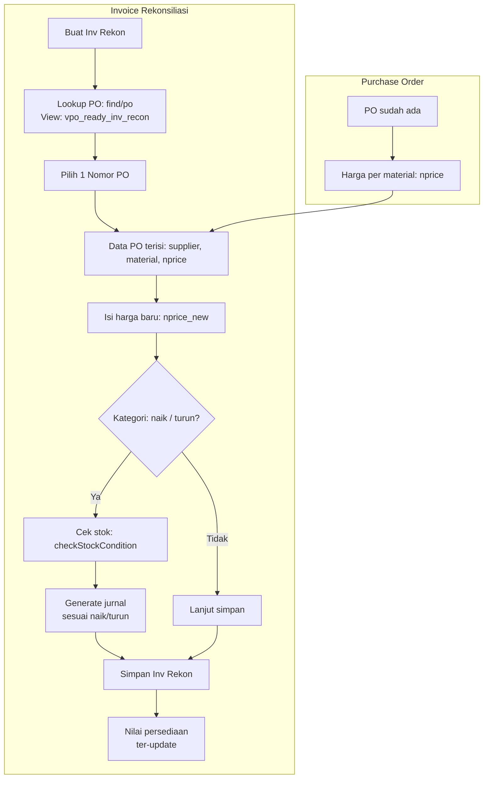
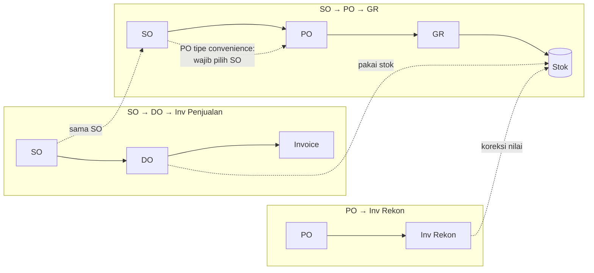
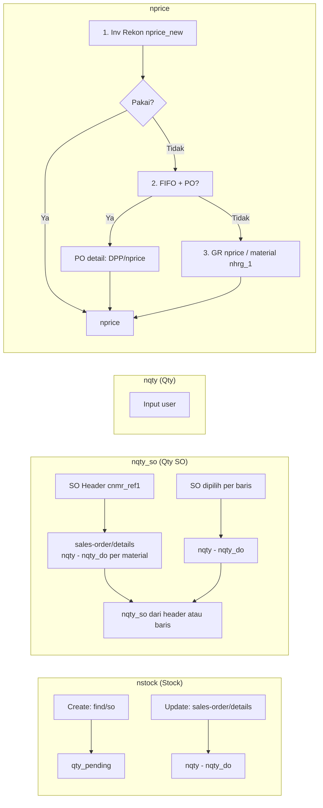
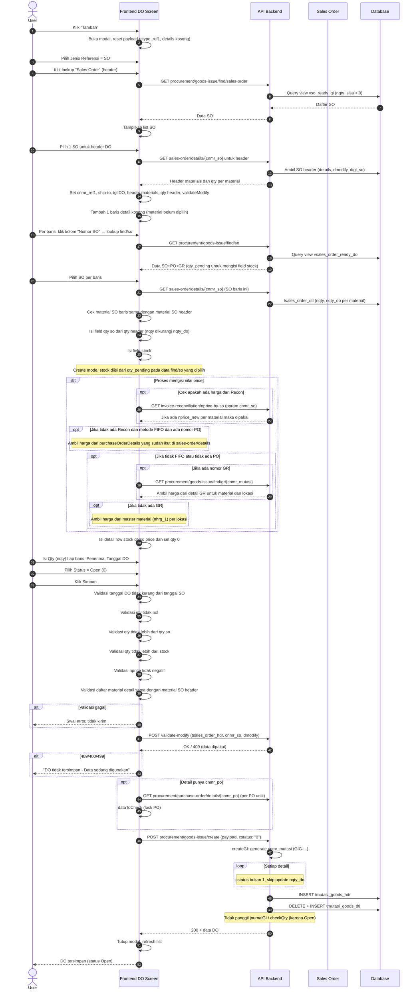
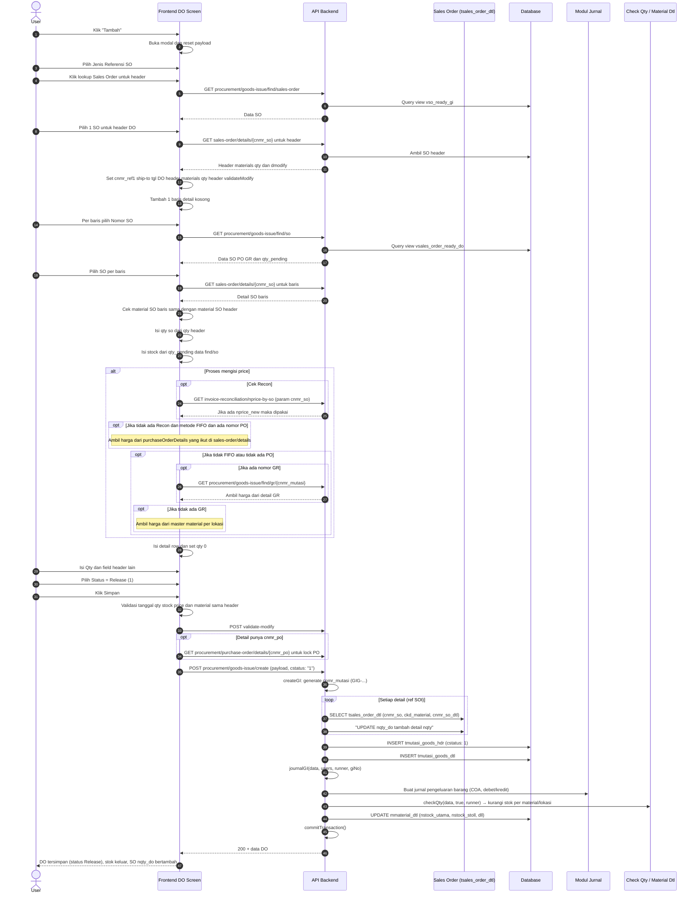
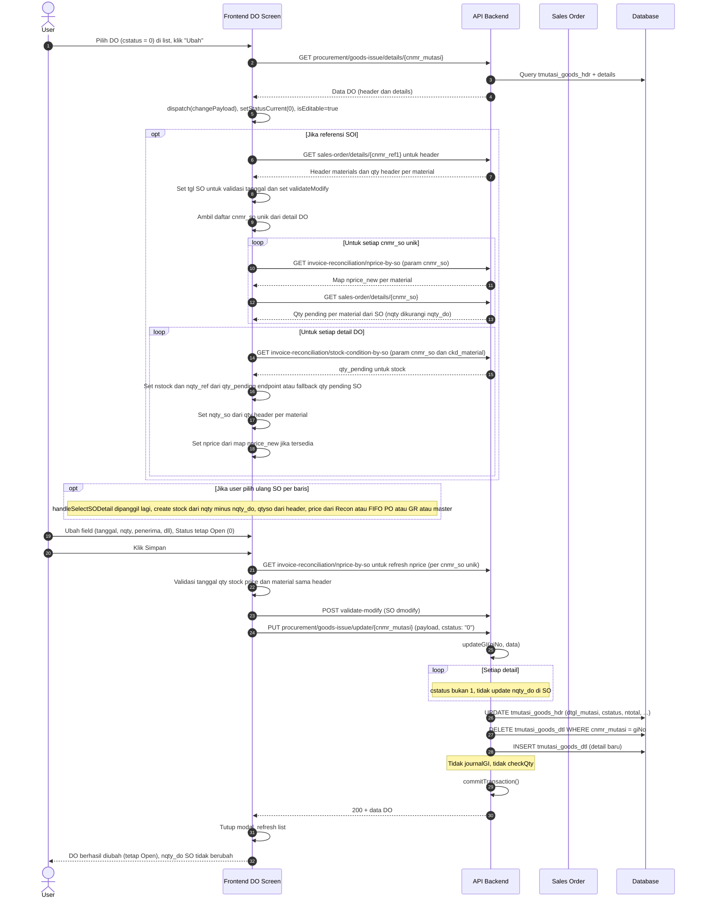
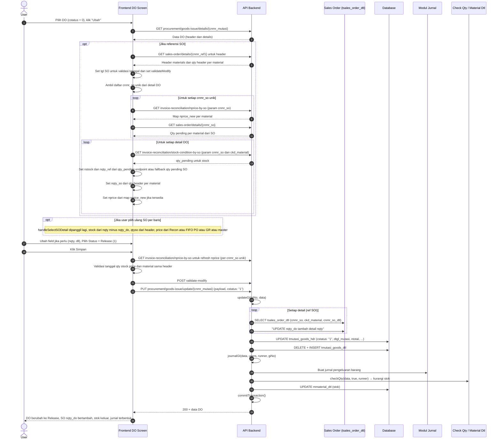

# Flowchart Tiga Proses Bisnis

Dokumen ini berisi flowchart untuk tiga alur proses: **SO→PO→GR**, **SO→DO→Invoice Penjualan**, dan **PO→Invoice Rekon**.

---

## 1. Alur SO → PO → GR (Pembelian / Barang Masuk)

**Catatan:** Di SO, tipe barang **bukan** pertimbangan. Tipe barang baru menjadi pertimbangan di **PO** (jika Tipe Barang = convenience, maka Nomor SO wajib dipilih).

---

## 2. Alur SO → DO → Invoice Penjualan

---

## 3. Alur PO → Invoice Rekonsiliasi

---

## 4. Hubungan Antar Tiga Proses (Overview)

---

## 5. Ringkasan Singkat

| Alur | Titik kunci |
|------|-------------|
| **SO→PO→GR** | Di PO: jika Tipe Barang = convenience → wajib pilih SO; GR hanya dari PO → stok naik. |
| **SO→DO→Inv** | DO: SO header (sisa qty) + SO per baris (sudah PO+GR, qty pending); Invoice dari DO/SO ready. |
| **PO→Inv Rekon** | Pilih PO → isi harga baru → jurnal naik/turun → nilai persediaan dikoreksi. |

File ini bisa dibuka di editor yang mendukung Mermaid (VS Code dengan ekstensi Mermaid, atau render di GitHub/GitLab).

---

## 6. Sequence Diagram: Proses Delivery Order (DO)

Diagram di bawah menggambarkan alur **Create** (dengan status Open dan Release) serta **Update** (Open→Open dan Open→Release) beserta validasi dan efek di backend (SO, stok, jurnal).

---

### Sumber Data: Stock, Qty SO, Qty, dan nprice di DO (penekanan)

Empat field utama di detail DO dan **dari mana datanya berasal** (hanya untuk referensi **SO / SOI**):

| Field | Sumber data | Keterangan |
|-------|-------------|------------|
| **Stock (nstock)** | **Create:** dari lookup **find/so** (view `vsales_order_ready_do`) → kolom **qty_pending** (qty pending untuk kombinasi SO+PO+GR yang dipilih). **Update (saat buka modal):** FE memanggil `invoice-reconciliation/stock-condition-by-so` (param `cnmr_so` + `ckd_material`) → **qty_pending** untuk stock; **fallback** ke `sales-order/details` → **nqty − nqty_do**. **Update (saat pilih ulang SO per baris):** dari `sales-order/details` → **nqty − nqty_do** (karena mode edit). | Menunjukkan “stok” yang boleh dikirim untuk baris itu. Validasi: `nstock ≥ 1` dan **detail.nqty ≤ detail.nstock** (Qty DO tidak melebihi stock). |
| **Qty SO (nqty_so)** | Diisi saat user **pilih SO per baris** di kolom Nomor SO. **nqty_so** = `qtyByMaterialFromHeader[ckd_material] ?? qtyPendingFromSO`. • **qtyByMaterialFromHeader:** dari SO **header** (`cnmr_ref1`) via **sales-order/details** → **(nqty − nqty_do)** per material. • **qtyPendingFromSO:** dari detail SO **yang dipilih di baris** → **(nqty − nqty_do)** untuk material itu. | Batas maksimal qty DO per baris (sisa SO). Validasi: **detail.nqty ≤ nqty_so** (“Qty DO tidak boleh melebihi Qty SO”). Tampil di kolom “Qty SO”. |
| **Qty (nqty)** | **Input user** (kolom QTY di tabel detail). | Qty yang akan dikirim. Validasi: > 0, ≤ nqty_so, ≤ nstock. |
| **nprice** | **Urutan prioritas:** 1) **Invoice Reconciliation:** GET `invoice-reconciliation/nprice-by-so?cnmr_so=...` → **nprice_new** per material; jika ada dan ≥ 0 → dipakai. 2) **Metode persediaan FIFO dan detail punya cnmr_po:** dari **PO** (purchaseOrderDetails) → jika PPN include (cjns_ppn = "0") → **nprice/1.11** (DPP), else **nprice**. 3) **Lainnya:** dari **GR** (find/gr oleh cnmr_mutasi) → **nprice** detail GR untuk material+lokasi; bila tidak ada GR → **master material** (barang.detail per cloc) → **nhrg_1**. | Harga per satuan di DO (untuk total & jurnal). Validasi (bukan free): nprice ≥ 0. |

Diagram alur sumber data (untuk referensi SOI):

**Kapan diisi:** Stock, Qty SO, dan nprice per baris diisi saat user **memilih Nomor SO di kolom detail** (lookup `find/so` → `handleSelectSODetail`). Qty diisi user setelah baris ada. Saat **buka modal update** DO, FE juga melakukan pengayaan data: **nprice** dari `invoice-reconciliation/nprice-by-so` dan **nstock** dari `invoice-reconciliation/stock-condition-by-so` (fallback ke `sales-order/details`).

---

### 6.1 Create DO dengan Status Open

### 6.2 Create DO dengan Status Release

### 6.3 Update DO dari Status Open ke Open

### 6.4 Update DO dari Status Open ke Release

### Ringkasan Perbedaan Empat Skenario

| Skenario | Status dikirim | Update nqty_do di SO? | Jurnal GI? | Update stok? |
|----------|----------------|------------------------|------------|--------------|
| Create + Open | cstatus: "0" | Tidak | Tidak | Tidak |
| Create + Release | cstatus: "1" | Ya (tambah per detail) | Ya | Ya (keluar) |
| Update Open→Open | cstatus: "0" | Tidak | Tidak | Tidak |
| Update Open→Release | cstatus: "1" | Ya (tambah per detail) | Ya | Ya (keluar) |

**Sumber field di sequence Create/Update:**  
- **nstock:** Create = find/so qty_pending; Update (buka modal) = stock-condition-by-so qty_pending (fallback sales-order/details nqty minus nqty_do); Update (pilih ulang SO) = sales-order/details nqty minus nqty_do.  
- **nqty_so:** sales-order/details (header + per SO) → nqty − nqty_do.  
- **nqty:** input user; validasi ≤ nqty_so, ≤ nstock.  
- **nprice:** Inv Rekon (nprice-by-so) → PO (FIFO) → GR/material; saat Update sebelum Simpan: refresh via invoice-reconciliation/nprice-by-so.
